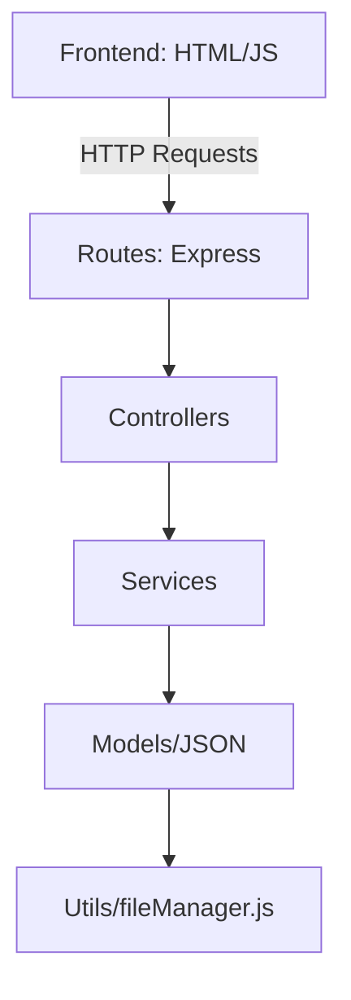

# 🎬 CineFlash - Sistema de Reservas de Cine

## 🧩 Descripción del Proyecto

CineFlash es una aplicación sencilla desarrollada con **JavaScript** orientada a la gestión de usuarios, funciones de cine y reservas de butacas. Utiliza archivos JSON como base de datos y está estructurada siguiendo principios SOLID y el patrón MVC (Modelo - Vista - Controlador).

El sistema permite:

- Registrar, consultar, actualizar y eliminar usuarios.
- Listar y crear funciones de cine (película, fecha, sala, precio).
- Reservar y cancelar butacas por función.
- Consultar reservas por usuario y ver todas las reservas.

---


## 🎯 2. Objetivos y Restricciones del Negocio

### ✅ Objetivos

- Digitalizar el proceso de registro de usuarios y gestión de funciones.
- Permitir reservas de butacas de forma clara y sencilla.
- Evitar reservas duplicadas o sobreocupación de funciones.
- Acceso rápido a la cartelera y reservas por usuario.

### 🚫 Restricciones

- El sistema debe funcionar sin conexión a bases de datos externas (uso de archivos JSON).
- Solo se pueden hacer reservas si hay butacas disponibles.
- No se permiten funciones con ID duplicado.

---

## 🖥️ 3. Restricción Tecnológica

> 🔧 El sistema debe estar desarrollado **completamente en JavaScript** para su backend y lógica, con archivos JSON como almacenamiento local y HTML para la interfaz.

---

## 👥 4. Historias de Usuario

### HU1. Registrar usuario
- **Como** nuevo usuario,
- **Quiero** registrarme con mi nombre y correo electrónico,
- **Para** poder hacer reservas.

**Criterio de aceptación:** El correo no debe estar repetido. El sistema confirmará el registro.

---

### HU2. Ver datos de un usuario
- **Como** administrador,
- **Quiero** buscar un usuario por correo,
- **Para** ver su información y reservas.

**Criterio de aceptación:** Si el correo no existe, debe devolver error 404.

---

### HU3. Crear función
- **Como** administrador,
- **Quiero** crear funciones con ID, nombre de película, fecha, sala y precio,
- **Para** que los usuarios puedan reservar.

**Criterio de aceptación:** No se pueden crear funciones con ID repetido.

---

### HU4. Ver cartelera
- **Como** usuario,
- **Quiero** ver la lista de funciones disponibles,
- **Para** elegir la película y horario de mi preferencia.

**Criterio de aceptación:** Debe devolver una lista JSON con los detalles.

---

### HU5. Reservar butacas
- **Como** usuario registrado,
- **Quiero** seleccionar función y butacas,
- **Para** asegurar mis asientos.

**Criterio de aceptación:** No deben estar ocupadas. Confirmación inmediata.

---

### HU6. Cancelar reserva
- **Como** usuario,
- **Quiero** cancelar mis butacas reservadas,
- **Para** liberar esos asientos si no voy a asistir.

**Criterio de aceptación:** Solo debe cancelar si los datos coinciden exactamente.

---

## ⚙️ 5. ASRs – Atributos de Calidad (Arquitectura)

- **Disponibilidad:** El sistema debe estar listo localmente sin necesidad de servidores externos.
- **Simplicidad:** Fácil de mantener y entender gracias a su separación en controladores, servicios y rutas.
- **Escalabilidad:** La arquitectura permite migrar fácilmente de archivos JSON a una base de datos real.
- **Usabilidad:** Interfaz HTML con botones para cada acción, ideal para pruebas.

---

## 🏗️ 6. Arquitectura de Software

El proyecto sigue el patrón **MVC (Modelo - Vista - Controlador)** con separación clara de responsabilidades y principios SOLID.

### 📁 Estructura del Proyecto:
```
📁 cine/
│
├── 📂 controllers/ # 🚦 Controladores HTTP
│ ├── 📄 usuarioController.js
│ ├── 📄 funcionController.js
│ └── 📄 reservaController.js
│
├── 📂 services/ # ⚙️ Lógica de negocio
│ ├── 📄 usuarioService.js
│ ├── 📄 funcionService.js
│ └── 📄 reservaService.js
│
├── 📂 routes/ # 🛣 Definición de endpoints
│ ├── 📄 usuarioRoutes.js
│ ├── 📄 funcionRoutes.js
│ └── 📄 reservaRoutes.js
│
├── 📂 models/ # 🗃 Datos en JSON
│ ├── 📄 usuarios.json
│ ├── 📄 funciones.json
│ └── 📄 reservas.json
│
├── 📂 utils/ # 🧰 Utilidades
│ └── 📄 fileManager.js
│
├── 📂 public/ # 🌐 Frontend
│ └── 📄 index.html
│
├── 📄 index.js # ⚡ Punto de entrada
└── 📄 package.json # 📦 Configuración

```
---

## 🔄 Endpoints Rápidos

| Acción              | Método | URL                         | Body (JSON) |
|---------------------|--------|-----------------------------|-------------|
| Registrar usuario   | POST   | `/usuarios`                 | `{ "nombre": "Juan", "email": "x@x.com" }` |
| Obtener usuario     | GET    | `/usuarios/juan@example.com` | - |
| Actualizar usuario  | PUT    | `/usuarios/juan@example.com` | `{ "nombre": "Juan Actualizado" }` |
| Eliminar usuario    | DELETE | `/usuarios/juan@example.com` | - |
| Listar funciones    | GET    | `/funciones`                | - |
| Crear función       | POST   | `/funciones`                | `{ "id": "f1", "pelicula": "Matrix", "fechaHora": "2025-06-04T20:00", "sala": "1", "precio": 10 }` |
| Reservar butacas    | POST   | `/reservas`                 | `{ "email": "juan@example.com", "funcionId": "f1", "butacas": [1,2] }` |
| Cancelar reserva    | DELETE   | `/reservas/cancelar`        | `{ "email": "juan@example.com", "funcionId": "f1", "butacas": [1,2] }` |
| listar usurios    | GET   | `/usuarios/`        |  - | 
---

## 📋 Requisitos

- Node.js instalado
- Proyecto clonado localmente
- Archivos JSON precargados o vacíos

---

## 🚀 Autor

Rober Ceballos
## 🏗️ Arquitectura del Sistema


---
## 🏗️ Diagrama de Componentes Completos

```mermaid
flowchart LR
    subgraph Frontend
    A[Interfaz HTML] -->|Fetch API| B[Backend]
    end

    subgraph Backend
    B --> C[Routes]
    C --> D[Controllers]
    D --> E[Services]
    E --> F[Models/JSON]
    F --> G[Utils/fileManager.js]
    end

    style A fill:#4CAF50,stroke:#388E3C
    style B fill:#2196F3,stroke:#1565C0
    style C fill:#FF9800,stroke:#F57C00
    style D fill:#9C27B0,stroke:#7B1FA2
    
    
    ```